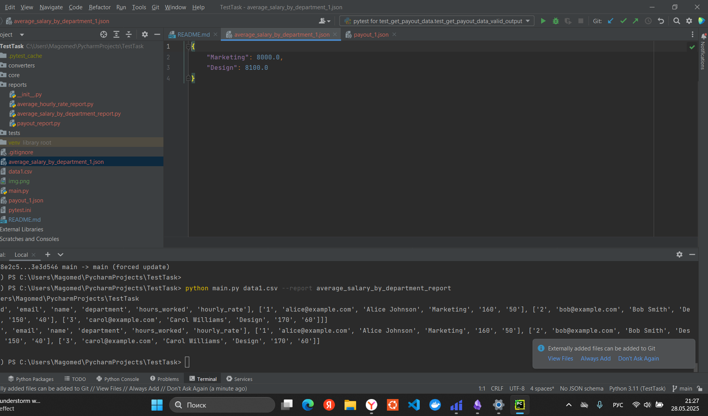
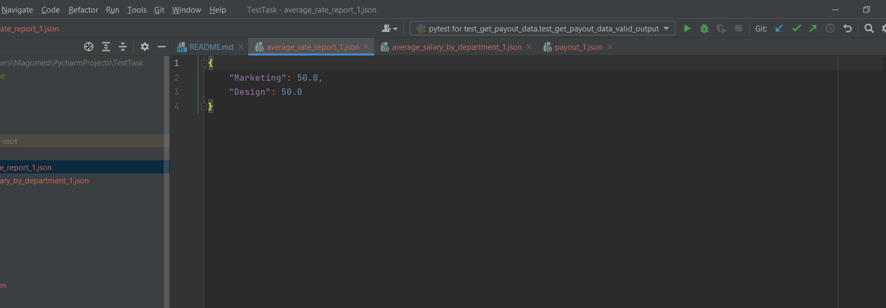

Функционал:
1)Преобразование данных из файла csv в отчеты, а затем вывод в доступных форматах (например JSON)
2)Добавлена логика преобразования полей к единому формату для облегчения составления отчетов
3)архитектура составлена так, что бы было легко добавлять новые типы отчетов и выходных форматов 
4)Выходной формат можно указать с помощью параметра --format
5)Типы отчетов решил формировать по названию файлов где есть методы формарования этих отчетов

Примеры:
1)При запуске python main.py data1.csv --report payout_report
Получаем файл payout_1.json

2)При запуске python main.py data1.csv --report average_salary_by_department_report
получаем 

3)При запуске python main.py data1.csv data2.csv data3.csv --report average_hourly_rate_report --format json
получаем  

4) python main.py C:\Users\Magomed\PycharmProjects\TestTask\data1.csv  --report average_hourly_rate_report --format json
Получаем 

Так же если указать не тот путь к файлу, будет выведена ошибка 
Пример
python main.py C:\Users\Magomed\PycharmProjects\TestTask\data21.csv  --report average_hourly_rate_report --format json

Вывод 
usage: main.py [-h] [--report REPORT] [--format {json,pdf,docx}] paths [paths ...]
main.py: error: argument paths: Путь C:\Users\Magomed\PycharmProjects\TestTask\data21.csv не существует
